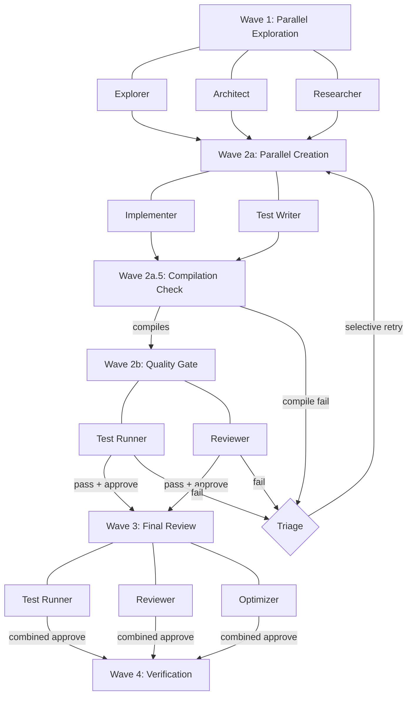
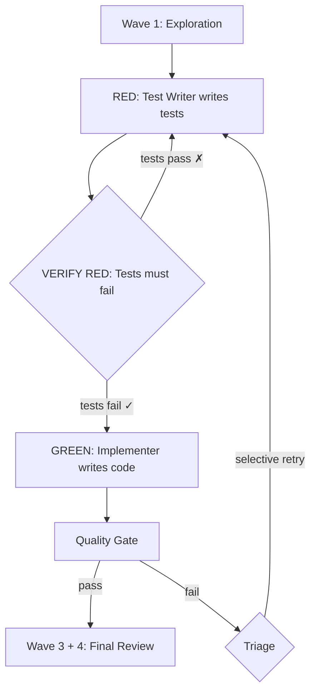

# golang-workflow

**TDD-first parallel agents with intelligent failure triage for Claude Code**


---

## Why golang-workflow?

- **9 specialized agents** that explore, design, implement, test, review, and optimize your Go code — each with a focused role and the right model for the job
- **Test-implementation isolation** ensures unbiased test coverage — the test writer never sees your implementation code, and the implementer never sees the test code
- **Intelligent failure triage** classifies each test failure as a code bug, test bug, or contract mismatch, then re-runs only the agent that needs fixing
- **Dual-mode orchestration** — parallel mode for speed, TDD mode (`--tdd`) for strict red-green-refactor discipline
- **Automated quality gates** with race detection, coverage thresholds, static analysis, and linting — zero configuration required
- **40 skill files** encoding idiomatic Go patterns for concurrency, error handling, interfaces, nil safety, testing, and linting

## Quick Start

### Installation

```
/install-plugin <marketplace-url>
```

### Usage

Run a full parallel implementation workflow:
```
/implement Add a rate-limited HTTP client with exponential backoff
```

Run with strict TDD (tests first, verified to fail, then implementation):
```
/implement --tdd Add a concurrent-safe LRU cache with TTL expiration
```

Lightweight bug fix or refactor:
```
/patch Fix the nil pointer dereference in ParseConfig when input is empty
```

The plugin orchestrates the rest — exploration, design, implementation, testing, review, and optimization happen automatically across specialized agents.

---

## Features

### Test-Implementation Isolation

Traditional AI coding writes tests after seeing the implementation, creating tests that mirror the code rather than verify the contract. golang-workflow solves this:

| | Test Writer | Implementer |
|---|---|---|
| **Sees** | Test specifications (scenarios, error conditions, edge cases) | Architecture design + test expectations (WHAT is tested) |
| **Does NOT see** | Implementation code | Test code (HOW it's tested) |
| **Writes** | `*_test.go` files from specification only | `*.go` files to satisfy the contract |

The test writer works from the architect's specification — scenario tables, error conditions, edge cases, fuzz targets — without any knowledge of how the code is structured. The implementer knows what behaviors will be tested but not how the tests assert them. This separation produces tests that genuinely verify the contract rather than parroting the implementation.

<details>
<summary><strong>9 Specialized Agents</strong></summary>

Each agent has a focused role, specific tools, and the right model tier:

| Agent | Model | Role | Active In |
|---|---|---|---|
| **explorer** | sonnet | Code investigation, architecture mapping, dependency analysis | Wave 1 |
| **architect** | opus | Interface design, package structure, test specifications | Wave 1 |
| **researcher** | sonnet | Web search for Go docs, best practices, library documentation | Wave 1 |
| **implementer** | sonnet | Writes idiomatic Go code (NOT tests) — has fix mode for targeted repairs | Wave 2 |
| **test-writer** | opus | Writes tests from specifications only — has fix mode for test iteration | Wave 2 |
| **test-runner** | sonnet | Executes tests, race detection, coverage, linting, compilation checks | Wave 2, 3 |
| **reviewer** | opus | Code quality review only (NO test execution) | Wave 2, 3 |
| **optimizer** | sonnet | Performance analysis, benchmarks, memory profiling | Wave 3 |
| **triage** | sonnet | Classifies failures as CODE_BUG, TEST_BUG, or CONTRACT_MISMATCH | On failure |

Opus-tier agents handle tasks requiring deeper reasoning (architecture, test design, code review). Sonnet-tier agents handle execution-heavy tasks (exploration, implementation, testing, optimization).

</details>

<details>
<summary><strong>Parallel Mode Workflow</strong></summary>

The default mode runs agents in parallel wherever possible, with quality gates that block progression until both tests pass and code review approves.



**Wave breakdown:**

1. **Wave 1 — Exploration:** Explorer maps the codebase, architect designs interfaces and test specifications, researcher finds relevant Go docs and best practices. All three run in parallel.

2. **Wave 2a — Creation:** Implementer writes `*.go` files while test writer independently writes `*_test.go` files from the specification. Strict isolation enforced.

3. **Wave 2a.5 — Compilation Check:** A fast `go build` + `go vet` pre-flight catches signature mismatches between implementation and tests before running the expensive full test suite.

4. **Wave 2b — Quality Gate:** Test runner executes `go test -v`, `go test -race`, `go vet`, coverage, and linting in parallel with the code reviewer. Both must pass to proceed.

5. **On Failure — Triage:** The triage agent classifies each failure and only the responsible agent re-runs. No wasted context re-running agents that got it right.

6. **Wave 3 — Final Review:** Full test suite, comprehensive code review, and performance analysis run in parallel across all implementation stages.

7. **Wave 4 — Verification:** Final build + test + vet confirmation.

High-complexity implementations (>5 files OR >500 lines) automatically scale to 2 reviewers with different focus areas.

</details>

<details>
<summary><strong>TDD Mode</strong></summary>

Enable with `--tdd` for strict red-green-refactor discipline:



1. **RED:** Test writer creates tests from the specification before any implementation exists
2. **VERIFY RED:** Test runner confirms the tests actually fail — proving they test real behavior, not tautologies
3. **GREEN:** Implementer receives test expectations (what each test expects) but not the test code itself, and writes the minimum correct implementation to pass
4. **Quality Gate:** Same parallel test-runner + reviewer gate as parallel mode

If VERIFY RED finds tests that pass without implementation, they're flagged as tautological and the test writer re-runs with guidance.

</details>

<details>
<summary><strong>Intelligent Failure Triage</strong></summary>

When tests fail or the reviewer requests changes, the triage agent classifies each failure:

| Classification | Meaning | Action |
|---|---|---|
| **CODE_BUG** | Implementation doesn't match specification | Re-run implementer only with targeted fix guidance |
| **TEST_BUG** | Test has incorrect expectations or setup | Re-run test writer only in fix mode (isolation preserved) |
| **CONTRACT_MISMATCH** | Implementation and tests disagree on the interface | Re-run both with reconciliation guidance; escalate if persistent |

**Example:** Tests expect `ProcessOrder` to return `(Order, error)` but implementation returns `(*Order, error)`. Triage classifies this as CONTRACT_MISMATCH and provides specific fix guidance to both agents.

**Escalation rules:**
- Same failure across 2 retries → escalate to user (likely spec ambiguity)
- CONTRACT_MISMATCH persists after 1 retry → escalate immediately
- Maximum 3 triage-guided retry cycles before requiring user input

This saves significant context budget — instead of re-running both agents from scratch, only the agent responsible for the failure re-runs with targeted guidance.

</details>

<details>
<summary><strong>40 Skill Files</strong></summary>

Hierarchical Go knowledge base that agents reference during their work:

**Concurrency** (5 skills)
- Router, channels, context, goroutines, sync primitives

**Error Handling** (4 skills)
- Router, wrapping, sentinel errors, error checking

**Interfaces** (4 skills)
- Router, design patterns, embedding, pollution avoidance

**Nil Safety** (5 skills)
- Router, pointer guards, map guards, interface guards, slice guards

**Testing** (8 skills)
- Router, table-driven tests, subtests, helpers, benchmarks, fuzz testing, property-based testing, concurrency testing

**Linting** (4 skills)
- Router, go vet, staticcheck, golangci-lint

**Orchestration** (10 skills)
- Router, quality gate protocol, test requirements, complexity scaling, agent protocol router, test-writer isolation, failure triage, TDD protocol, anti-patterns

</details>

<details>
<summary><strong>Automated Hooks</strong></summary>

Three hooks run automatically with zero configuration:

| Trigger | Hook | What It Does |
|---|---|---|
| After `Write` | `go-fmt.sh` | Formats any written `.go` file with `gofmt` |
| After `Edit` | `go-vet.sh` | Runs `go vet` on edited `.go` files |
| Before `Bash` | `go-precommit.sh` | Runs `golangci-lint` before git commits |

Hooks are shell scripts in `hooks/scripts/` referenced via `${CLAUDE_PLUGIN_ROOT}`. They activate automatically when the plugin is installed — no configuration needed.

</details>

<details>
<summary><strong>Lightweight /patch Command</strong></summary>

For bug fixes and small refactors that don't need full orchestration:

| | `/implement` | `/patch` |
|---|---|---|
| **Agents used** | All 9 | 6 (no architect, researcher, optimizer) |
| **Phases** | 4 waves | 2 phases (explore → patch + gate) |
| **Retry budget** | 3 triage cycles | 2 triage cycles |
| **Best for** | New features, major changes | Bug fixes, small refactors |
| **Multi-stage** | Full sequential support | Supported for dependent packages |

Use `/patch` when you know what's wrong and where. Use `/implement` when the task requires design decisions or exploration.

</details>

---

## Commands Reference

### `/implement [--tdd] <task>`

Full orchestrated Go development workflow.

```
/implement Add a middleware chain for HTTP request logging and authentication
/implement --tdd Implement a concurrent-safe connection pool with health checks
```

**Flags:**
- `--tdd` — Enable TDD mode (RED → VERIFY RED → GREEN → Quality Gate)

**What it does:**
1. Explores your codebase, designs interfaces, researches best practices (parallel)
2. Writes implementation and tests with enforced isolation (parallel)
3. Runs compilation check, full test suite, race detection, coverage, linting, and code review
4. On failure: triages, classifies, and selectively retries
5. Final review with performance analysis and verification

### `/patch <description>`

Lightweight bug fix and refactor workflow.

```
/patch Fix the race condition in SessionManager.Close when called concurrently
/patch Refactor the error handling in pkg/api to use wrapped errors consistently
```

**What it does:**
1. Explores the relevant code area
2. Patches implementation and updates tests in parallel with isolation
3. Compilation check → quality gate with triage-based retry (2-cycle budget)

Supports multi-stage patches when fixes span dependent packages.

---

<details>
<summary><h2>Architecture</h2></summary>

### Repository Structure

```
.claude-plugin/
  plugin.json              # Plugin manifest (name, version, description)
agents/
  explorer.md              # Code investigation agent
  architect.md             # Interface design agent
  researcher.md            # Documentation research agent
  implementer.md           # Code writing agent
  test-writer.md           # Test writing agent (isolated)
  test-runner.md           # Test execution agent
  reviewer.md              # Code review agent
  optimizer.md             # Performance analysis agent
  triage.md                # Failure classification agent
commands/
  implement.md             # /implement command orchestration
  patch.md                 # /patch command orchestration
hooks/
  hooks.json               # Hook event configuration
  scripts/
    go-fmt.sh              # gofmt after writes
    go-vet.sh              # go vet after edits
    go-precommit.sh        # golangci-lint before commits
skills/
  golang/                  # Go knowledge base (30 skills)
    concurrency/           # channels, context, goroutines, sync
    errors/                # wrapping, sentinel, checking
    interfaces/            # design, embedding, pollution
    nil/                   # pointer, map, interface, slice
    testing/               # table, subtests, helpers, benchmarks,
                           # fuzz, property, concurrency
    linting/               # vet, staticcheck, golangci
  orchestration/           # Workflow protocols (10 skills)
    quality-gate/          # verdict handling, test requirements,
                           # complexity scaling
    agent-protocols/       # test-writer isolation, failure triage,
                           # TDD protocol
    anti-patterns.md       # common mistakes, context budget
```

### Agent Definition Format

Agents are markdown files with YAML frontmatter:

```yaml
---
name: Go Implementer
description: Writes idiomatic Go code from architectural designs
model: sonnet
tools:
  - Glob
  - Grep
  - Read
  - Edit
  - Write
  - Bash
skills:
  - golang
color: green
---

# System prompt content follows...
```

### Skill File Format

Skills are markdown files with correct/incorrect patterns:

```yaml
---
name: go-error-wrapping
description: Error wrapping patterns using fmt.Errorf with %w
---
```

```go
// Correct: wrap with context
if err != nil {
    return fmt.Errorf("opening config %s: %w", path, err)
}

// Incorrect: loses error chain
if err != nil {
    return fmt.Errorf("opening config: %s", err.Error())
}
```

### Quality Gate Verdicts

The combined verdict from parallel test-runner + reviewer determines progression:

| Test Runner | Reviewer | Combined | Action |
|---|---|---|---|
| TESTS_PASS | APPROVE | **APPROVE** | Proceed to next stage/wave |
| TESTS_PASS | REQUEST_CHANGES | **REQUEST_CHANGES** | Triage → re-run reviewer-identified fixes |
| TESTS_FAIL | APPROVE | **TESTS_FAIL** | Triage → re-run failing agent(s) |
| TESTS_FAIL | REQUEST_CHANGES | **TESTS_FAIL** | Triage → address both test and review issues |
| Any | NEEDS_DISCUSSION | **NEEDS_DISCUSSION** | Escalate to user for design input |

</details>

---

## Requirements

| Requirement | Status | Notes |
|---|---|---|
| **Go 1.18+** | Required | Needed for fuzz testing support and generics |
| **Claude Code** | Required | With plugin support enabled |
| **golangci-lint** | Optional | Pre-commit hook degrades gracefully if not installed |

---

<details>
<summary><h2>FAQ</h2></summary>

### When should I use `/implement` vs `/patch`?

Use **`/implement`** for new features, major refactors, or tasks requiring design decisions. It runs the full 4-wave workflow with architect, researcher, and optimizer agents.

Use **`/patch`** for bug fixes and small refactors where you already know what's wrong. It skips the design phase and uses a leaner 2-phase workflow with a smaller retry budget.

### Can I use this with existing Go projects?

Yes. The explorer agent maps your existing codebase structure, patterns, and conventions before any code is written. The implementer and test writer follow your project's established patterns. Hooks automatically format and lint only the files that are written or edited.

### What if golangci-lint isn't installed?

The pre-commit hook checks for `golangci-lint` and skips gracefully if it's not found. The test runner falls back to `staticcheck` or `go vet` if the full linter suite isn't available. All other functionality works without it.

</details>

---

## Changelog

See [CHANGELOG.md](CHANGELOG.md) for the full version history.

**Latest:**
- **[2.0.1](CHANGELOG.md)** — `/patch` command for lightweight bug fixes
- **[2.0.0](CHANGELOG.md)** — TDD mode, failure triage agent, selective retry, compilation pre-flight
- **[1.4.0](CHANGELOG.md)** — Extracted orchestration skills, 26% command size reduction

---

## License

MIT License — see [LICENSE](LICENSE).

---

<sub>Built for Go developers using [Claude Code](https://claude.ai/code) | Created by [James Prial](https://github.com/jamesprial)</sub>
